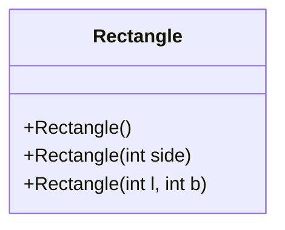
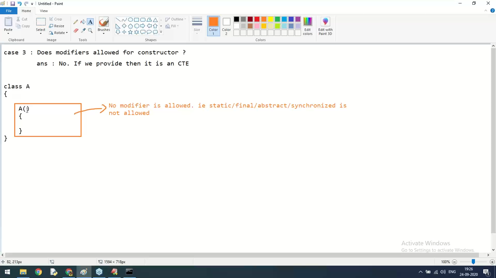

---

## Constructors in Java

### 1. What is a Constructor?
A **constructor** is a special method that is automatically called when an object of a class is created. It initializes the newly created object. Constructors have the same name as the class and do not have a return type (not even `void`).

**Key Points:**
- Constructor name must match the class name.
- No return type (not even `void`).
- Called automatically when you use `new` keyword.
- Used to set initial values for object attributes.
- Can be overloaded (multiple constructors with different parameters).

---

### 2. Types of Constructors

#### a) Default Constructor
- Provided by the compiler if no constructor is defined.
- Takes no arguments.
- Initializes instance variables to default values (0, null, false, etc.).

```java
class Student {
    String name;
    int age;

    // No constructor defined – compiler provides default constructor
}

// Usage
Student s = new Student(); // default constructor called
System.out.println(s.name); // null
System.out.println(s.age);  // 0
```

#### b) No-Argument Constructor (User-Defined)
- A constructor with no parameters explicitly written by the programmer.
- Overrides the default constructor.

```java
class Student {
    String name;
    int age;

    // User-defined no-arg constructor
    Student() {
        name = "Unknown";
        age = 0;
    }
}
```

#### c) Parameterized Constructor
- Accepts arguments to initialize object with specific values.

```java
class Student {
    String name;
    int age;

    Student(String n, int a) {
        name = n;
        age = a;
    }
}

Student s = new Student("Alice", 20);
```

#### d) Copy Constructor
- A constructor that takes an object of the same class and copies its fields.
- Java does not provide a default copy constructor; you must write it.

```java
class Student {
    String name;
    int age;

    Student(String n, int a) { name = n; age = a; }

    // Copy constructor
    Student(Student other) {
        this.name = other.name;
        this.age = other.age;
    }
}

Student s1 = new Student("Bob", 22);
Student s2 = new Student(s1); // copy of s1
```

---

### 3. Constructor Overloading
Like methods, constructors can be overloaded (multiple constructors with different parameters). The appropriate constructor is called based on the arguments passed.

```java
class Rectangle {
    int length, breadth;

    Rectangle() {
        length = breadth = 0;
    }

    Rectangle(int side) {
        length = breadth = side; // square
    }

    Rectangle(int l, int b) {
        length = l;
        breadth = b;
    }
}
```

---

### 4. Constructor Chaining
When one constructor calls another constructor of the same class using `this()`, it is called constructor chaining. This reduces code duplication.

**Rules for `this()`:**
- Must be the first statement in the constructor.
- Can only be used inside a constructor.

```java
class Employee {
    String name;
    int id;
    double salary;

    Employee() {
        this("Unknown", 0, 0.0); // calls the three-arg constructor
    }

    Employee(String name, int id, double salary) {
        this.name = name;
        this.id = id;
        this.salary = salary;
    }
}
```

---

### 5. Inheritance and Constructors
- When a subclass object is created, the superclass constructor is called first (implicitly or explicitly using `super()`).
- If the superclass has a parameterized constructor, the subclass must explicitly call it using `super(...)`.

```java
class Animal {
    String type;

    Animal(String t) {
        type = t;
        System.out.println("Animal constructor");
    }
}

class Dog extends Animal {
    String breed;

    Dog(String t, String b) {
        super(t); // must be first statement
        breed = b;
        System.out.println("Dog constructor");
    }
}

// Usage
Dog d = new Dog("Mammal", "Labrador");
```

**Output:**
```
Animal constructor
Dog constructor
```

---

### 6. Constructor Visibility and Access Modifiers
Constructors can have access modifiers to control who can create objects:
- `public` – any class can create objects.
- `protected` – same package or subclasses.
- `default` – only classes in same package.
- `private` – only within the class itself (used in singleton pattern).

---

### 7. Visualizing Constructor Flow

#### Diagram: Constructor Call Chain
```mermaid
flowchart TD
    A[Create Object: new Student()] --> B{Constructor called?}
    B --> C[Match arguments with constructor signature]
    C --> D[If no constructor defined, default provided]
    D --> E[If constructor defined, execute its body]
    E --> F[If this() exists, call another constructor first]
    E --> G[If super() exists (implicit or explicit), call superclass constructor first]
    G --> H[Initialize instance variables]
    H --> I[Return object reference]
```

#### Diagram: Constructor Overloading


---

### 8. Important Rules
1. A constructor cannot be `abstract`, `static`, `final`, or `synchronized`.
2. Constructors are not inherited, but they are invoked via `super()`.
3. If you define any constructor, the default constructor is not provided.
4. `this()` and `super()` cannot coexist in the same constructor (both must be first statement).
5. A constructor can throw exceptions.

---

### 9. Complete Example with Output

```java
class Book {
    String title;
    String author;
    double price;

    // Default constructor
    Book() {
        this("No Title", "Unknown", 0.0); // chaining
        System.out.println("Default constructor called");
    }

    // Parameterized constructor
    Book(String title, String author, double price) {
        this.title = title;
        this.author = author;
        this.price = price;
        System.out.println("Parameterized constructor called");
    }

    // Copy constructor
    Book(Book other) {
        this(other.title, other.author, other.price);
        System.out.println("Copy constructor called");
    }

    void display() {
        System.out.println(title + " by " + author + " - $" + price);
    }

    public static void main(String[] args) {
        Book b1 = new Book();                     // default
        Book b2 = new Book("Java", "James", 45.5); // parameterized
        Book b3 = new Book(b2);                   // copy
        b1.display();
        b2.display();
        b3.display();
    }
}
```

**Output:**
```
Parameterized constructor called
Default constructor called
Parameterized constructor called
Parameterized constructor called
Copy constructor called
No Title by Unknown - $0.0
Java by James - $45.5
Java by James - $45.5
```

---

### 10. Common Mistakes
- Forgetting that default constructor disappears after defining any constructor.
- Using `void` before constructor name (then it becomes a method, not a constructor).
- Recursive constructor call (e.g., calling `this()` inside the same constructor without a base case) leads to compilation error.

---

This comprehensive coverage of constructors with visual diagrams and examples should provide a solid understanding. You can save this as a separate markdown file or integrate it into your main Core Java notes.